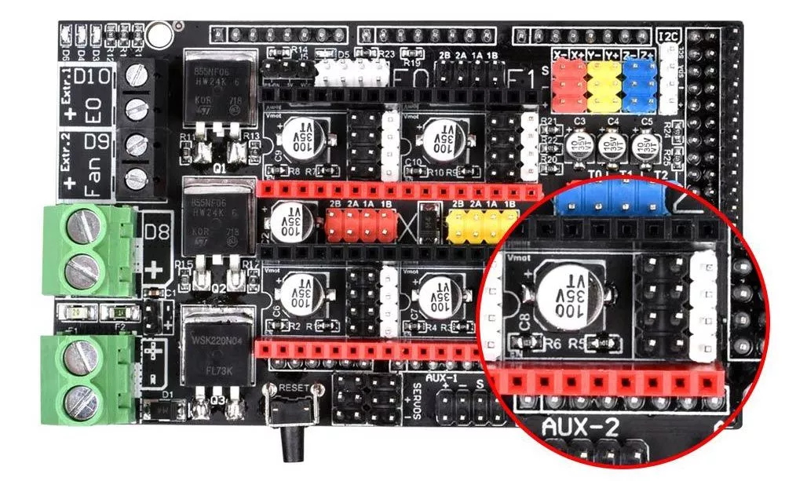
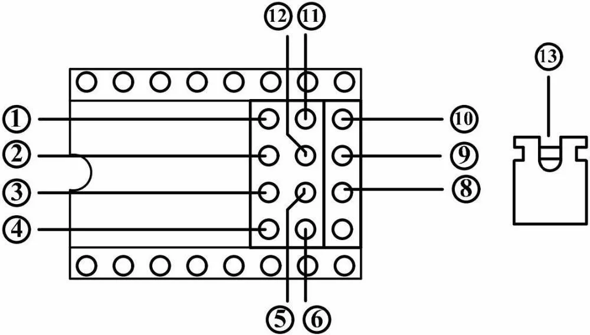
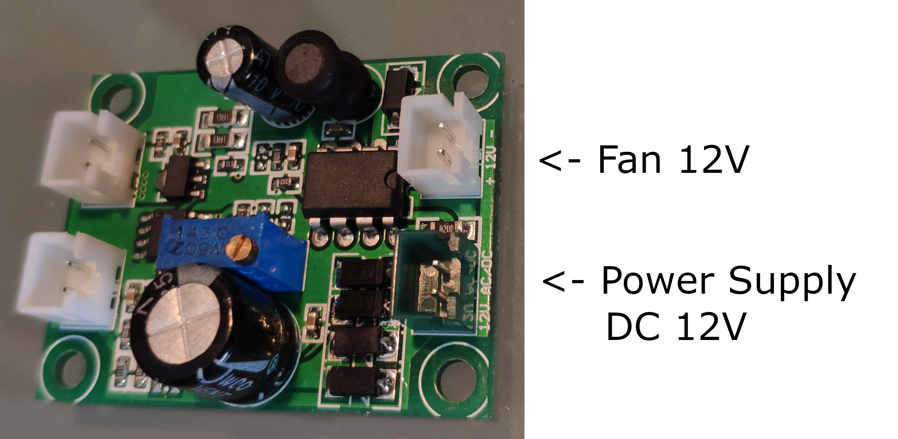
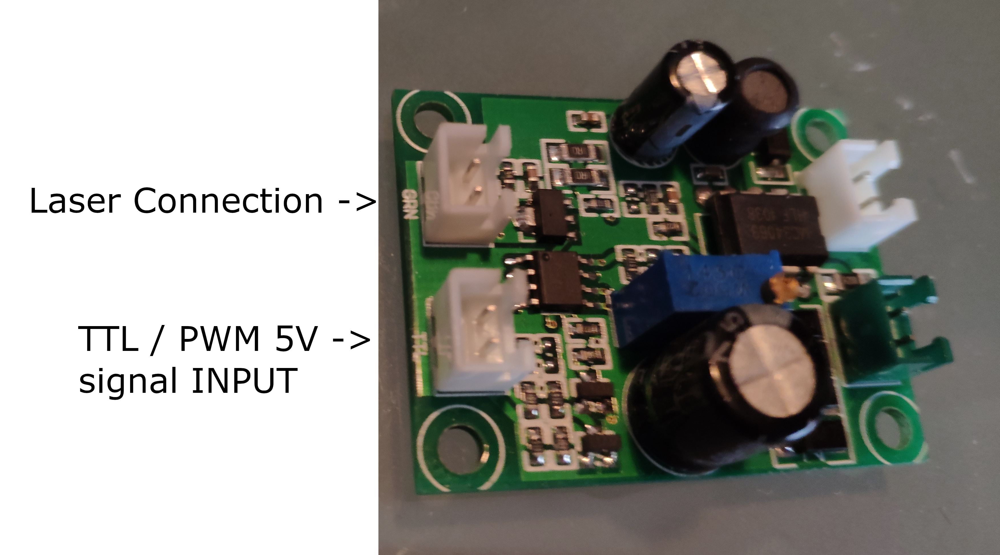

# Marlin 2.0.X Laser Engraver

## Board: Bigtreetech RAMPS 1.6 plus (RAMPS 1.4 Modified)

For our purpose, the Bigtreetech RAMPS 1.6 plus is the same board as RAMPS 1.4. So in the configuration, we define the baord:
#define BOARD_RAMPS_14_SF             1024  // RAMPS 1.4 (Power outputs: Spindle, Controller Fan)

Spindle and Laser Engraver use the same configuration

We use two steppers drivers for this board, X and Y axis. The drivers are A4988. We calibrate the drivers using this [page](http://www.dima3d.com/motores-paso-a-paso-en-impresion-3d-iii-calibracion-de-corriente/) (Spanish tutorial), but you could find a lot of information about it in internet, this drivers are so common.

This version of the popular Ramps 3D Printer electronics is a revision that integrates SPI compatibility, eliminating the need for extra wiring for the SPI pins.

### Characteristics

- Compatible with SPI and SPEP / DIR, configurable through the jumpers integrated on the board.
- 4-layer motherboard, which improves the operating temperature.
- High power connectors for bed and power.
- Mosfet WSK220N04 high power for the heated bed, supporting up to 220A.

### Modes

- To use the SPI mode you must connect 1 with 11, 2 with 12, 3 with 5, and 4 with 6. Leaving the white pins visible. Also, you must make sure that you have the pins assigned correctly. The default settings are: XCS: D63, YCS: D40, ZCS: D42, E0CS: D65 and E1CS: D66.

- To use the STEP / DIR mode you must connect the jumpers joining 11 with 10, 12 with 9 and 5 with 8, each of these three connections represent MS1, MS2, and MS3 respectively, so you can adjust the configuration of the controllers.

## Laser: Laser power 500 mW walelength 405 nm

## Screen: RepRapDiscount Smart Controller

This Smart Controller contains a SD-Card reader, a rotary encoder and a 20 Character x 4 Line LCD display. You can easy connect it to your Ramps board using the "smart adapter" included.

After connecting this panel to your Ramps you don't need your pc any more, the Smart Controller supplies power for your SD card. Further more all actions like calibration, axes movements can be done by just using the rotary encoder on the Smart Controller. Print your 3D designs without PC, just with a g-code design stored on the SD card.

[RepRapDiscount Smart Controller](https://reprap.org/wiki/RepRapDiscount_Smart_Controller)

Change line 1532 to #define REPRAP_DISCOUNT_SMART_CONTROLLER (just remove the // at the beginning)

Change line 1429 to #define SDSUPPORT (just remove the // at the beginning)

EXP1 is for LCD

EXP2 is for SDCard (Recommended to shield this cable with aluminium foils)

## Marlin Modding: Modify the code for show information want about laser Engraver

- Included new LCD_INFO_SCREEN_STYLE 2 for this purpose (line 724)
- Sanity check modified
- Line 1 - Recreated to show laser information status and power
- Line 2 - X axis and Y axis only. Z axis is remove because it is not used.
- Line 3 and 4 conserve the same information as LCD_INFO_SCREEN_STYLE 0

### Modified files
- Marlin-2.0.x/Marlin/src/lcd/HD44780/ultralcd_HD44780.cpp
- Marlin-2.0.x/Marlin/src/inc/SanityCheck.h

## Other thing

For this project, first I tried to use MKS Base v1.2. At the end, I found a lot of problems to use pwm with this board. I decided to use the ramps, but I think is useful to store the information related with this board for another project.
