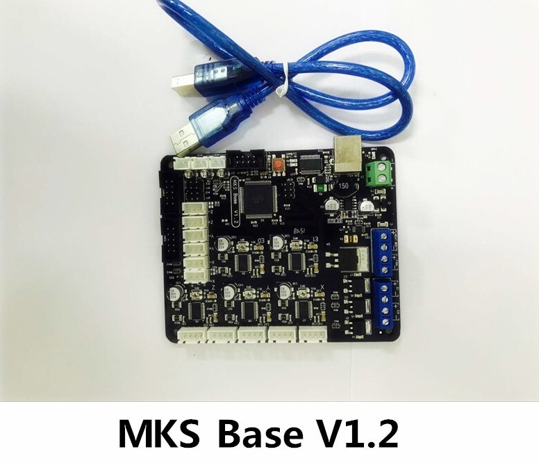

# Marlin 2.0.X Laser Engraver

## Board: MKS BASE 1.2

[MKS BASE 1.0 Information](https://reprap.org/wiki/MKS_BASE_1.0)
[Ks0089 MKS BaseV1.2 3D Printer Controller Board (RAMPS 1.4 + Arduino 2560 Remix Board)](https://wiki.keyestudio.com/Ks0089_MKS_BaseV1.2_3D_Printer_Controller_Board_(RAMPS_1.4_%2B_Arduino_2560_Remix_Board))

The MKS Base 1.2 use A4982SLPT, which is an improved version of the A4988 stepper motor controller driver chip.
The advantage to this chip is a larger package for heat dissipation.
Note: This driver does not allow 1/8 micro stepping, 1/2, 1/4 and 1/16 only.

The MKS Base 1.2 is the same board as RAMPS 1.4. So in the configuration, we define the baord:
#define BOARD_RAMPS_14_SF             1024  // RAMPS 1.4 (Power outputs: Spindle, Controller Fan)

Spindle and Laser Engraver use the same configuration

## Screen: RepRapDiscount Smart Controller

This Smart Controller contains a SD-Card reader, a rotary encoder and a 20 Character x 4 Line LCD display. You can easy connect it to your Ramps board using the "smart adapter" included.

After connecting this panel to your Ramps you don't need your pc any more, the Smart Controller supplies power for your SD card. Further more all actions like calibration, axes movements can be done by just using the rotary encoder on the Smart Controller. Print your 3D designs without PC, just with a g-code design stored on the SD card.

[RepRapDiscount Smart Controller](https://reprap.org/wiki/RepRapDiscount_Smart_Controller)

Change line 1532 to #define REPRAP_DISCOUNT_SMART_CONTROLLER (just remove the // at the beginning)

Change line 1429 to #define SDSUPPORT (just remove the // at the beginning)

EXP1 is for LCD

EXP2 is for SDCard (Recommended to shield this cable with aluminium foils)

# Purpose: Modify the code for show information want about laser Engraver

- Included new LCD_INFO_SCREEN_STYLE 2 for this purpose (line 724)
- Sanity check modified

## Modified files
- Marlin-2.0.x/Marlin/src/lcd/HD44780/ultralcd_HD44780.cpp
- Marlin-2.0.x/Marlin/src/inc/SanityCheck.h
